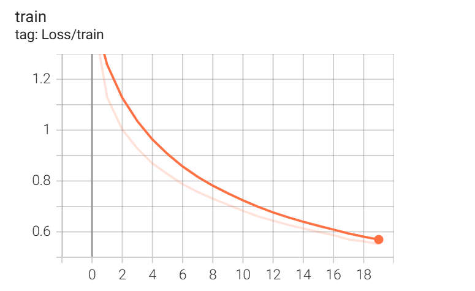
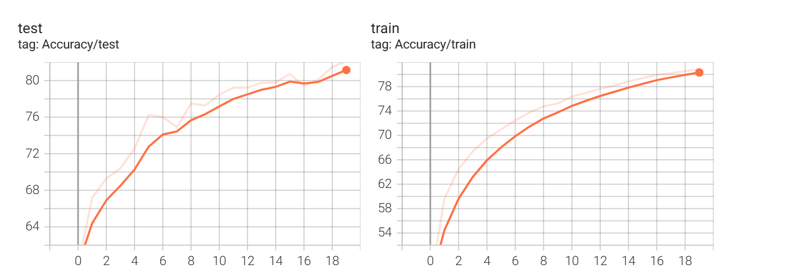
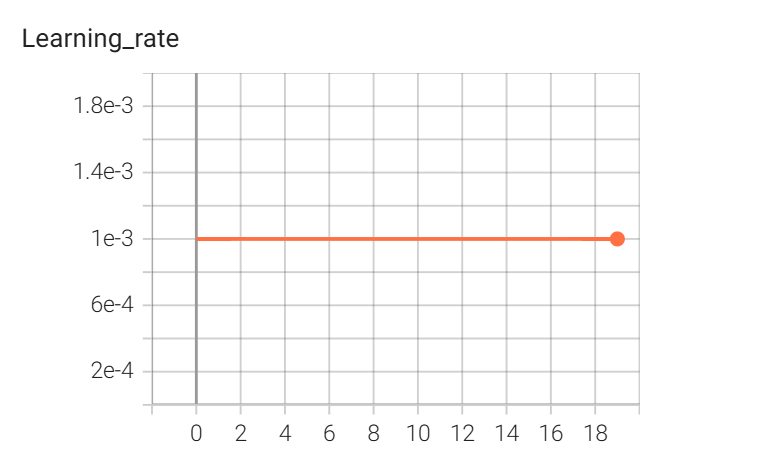
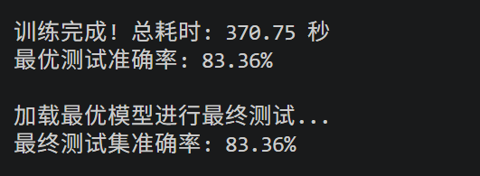
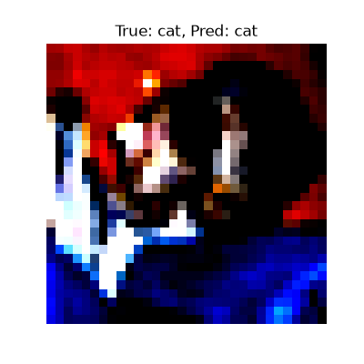
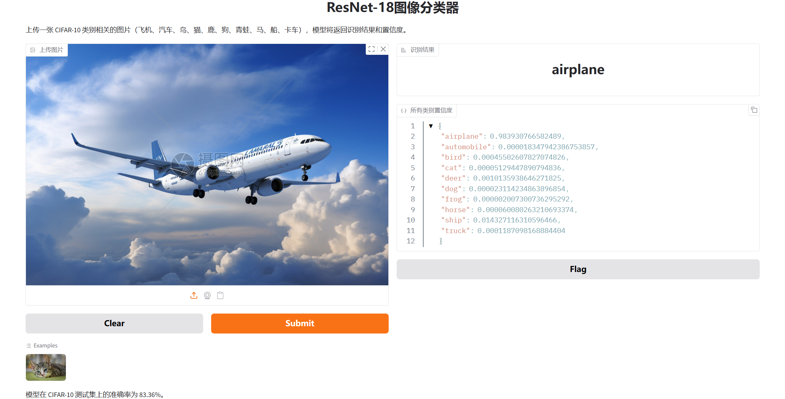

# CIFAR-10 图像分类

基于 PyTorch 的 CIFAR-10 图像分类项目，包含自定义 CNN 和 ResNet-18 迁移学习两种方案，完整实现了训练、调优、可视化和 Web 部署。

## 项目结构

```
cifar10-project/
├── cifar10_cnn.py              # 自定义 CNN 训练（数据增强 + BN + 学习率调度）
├── cifar10_resnet.py           # ResNet-18 迁移学习
├── cifar10_app.py              # Gradio Web 部署
├── cifar10_best.pth            # CNN 最优权重
├── cifar10_resnet_best.pth     # ResNet 最优权重
├── README.md
├── tensorboard_loss.png        # Loss 曲线
├── tensorboard_accuracy.png    # 准确率曲线
├── tensorboard_lr.png          # 学习率曲线
├── gradio_demo.png             # Web 界面截图
├── resnet_result.png           # ResNet 结果截图
└── prediction_example          # 预测示例图结果
```

## 模型对比

| 模型 | 测试准确率 | 说明 |
|------|-----------|------|
| 自定义 CNN | **82.13%** | 3 层卷积 + BatchNorm + 数据增强 + 学习率调度 |
| ResNet-18（迁移学习） | **83.36%** | 基于 ImageNet 预训练权重微调 |

## 训练可视化

以下为自定义 CNN 的训练曲线：

| Loss 曲线 | 准确率曲线 | 学习率曲线 |
|-----------|-----------|-----------|
|  |  |  |

## ResNet-18 训练结果



## 预测示例



## Web 部署

使用 Gradio 构建交互界面，支持上传图片实时识别。



## 运行方式

### 训练

```bash
# 自定义 CNN
python cifar10_cnn.py

# ResNet-18（迁移学习）
python cifar10_resnet.py
```

### Web 应用

```bash
python cifar10_app.py
```

## 技术栈

- PyTorch
- torchvision
- TensorBoard
- Gradio
- Matplotlib / NumPy

## 优化策略

- 数据增强（随机翻转、随机裁剪）
- Batch Normalization
- 学习率调度（ReduceLROnPlateau）
- 迁移学习（ResNet-18 预训练）
